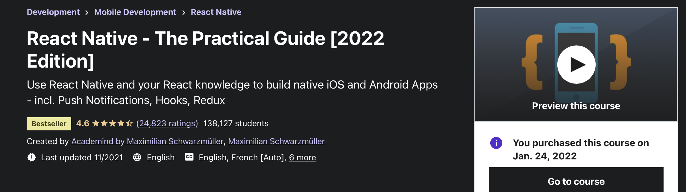

# React Native - The Practical Guide [2022 Edition] by Maximilian Schwarzmuller 
Course: (https://www.udemy.com/course/react-native-the-practical-guide/)  
Course length: <b>32.5 hours</b>

### About this course
Use React Native and your React knowledge to build native iOS and Android Apps - incl. Push Notifications, Hooks, Redux
